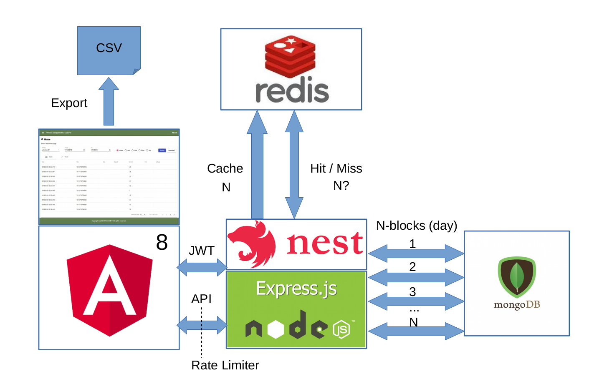

# Viriciti Assignment Exports

## Introduction

In order to be able to better assess my technical expertise, the kind folks at Viriciti assigned me this code challenge.

Hopefully the results will demonstrate that I am a qualified candidate and keep me in the loop of things.

For the latest version of this assignment you can access my private [viriciti-assignment-export](https://github.com/kgish/viriciti-assignment-export)
repository assuming I have designated you a collaborator.

See my contact information below.

## Problem

The main challenge is creating an export system that will not overflow the database system when a lot of export 
requests are issued.

The export system exposes a simple API which for a given vehicle and range of dates will return a dataset result 
consisting off all data falling within the start date and end date.


## Assignment 

The assignment can be found on the Viriciti github under [Exports assignment](https://github.com/viriciti/exports-assignment).

A data dump for three vehicles (vehicle_001, vehicle_002 and vehicle_003) was also provided.

The starting point was an example `unwind` utility and an `unwind_test` verification script written in the [CoffeeScript](https://coffeescript.org) programming language.

With the introduction of [ECMAScript 6](http://es6-features.org), CoffeeScript has become outdated and the typed superset of JavaScript known as [TypeScript](https://www.typescriptlang.org) can easily replace many of its features.

Also, the example utility uses the [UnderscoreJS](https://underscorejs.org) and [Async](https://caolan.github.io/async/v3) libraries which can to a large degree be replaced by the built-in `map`, `sort` aand `flatten` features currently available in ES6. 

By using [Promises](https://developer.mozilla.org/en-US/docs/Web/JavaScript/Reference/Global_Objects/Promise), for example `new Promise()` and `Promise.all()` we have a more elegant solution for handling asynchronous calls and avoiding the so-called callback hell.


## Plan of attack

These are the steps that I took in order to tackle this challenging assignment:

* Brush up on MongoDB.
* Rewrite the unwind utility and test in ES6 using TypeScript.
* Verify that the rewritten test works using a test MongoDB.
* Create a MongoDB docker container and import the data dump.
* Tried to learn [Express Gateway](https://www.express-gateway.io) but time was too limited.
* Decided instead to use [NestJS](https://nestjs.com) which is more familiar to me.
* Build the backend API server.
* Check out [Balena](https://www.balena.io) (formerly resin.io) but again time was too limited.
* Learn [Redis](https://redis.io) quickly.
* Create a Redis docker container and use it as a cache.
* Build a responsive [Angular](https://angular.io) frontend with [Material CDK](https://material.angular.io).
* Dockerize everything.
* Finalize this readme.
* Practice my presentation in front of the mirror.


## Prerequisites

You should have some knowledge of the following and have the relevant items installed.

* Angular
* Chai
* Chartjs
* Docker
* Git
* Jasmine
* Jest
* MongoDB
* NestJS
* Node
* Coca-cola
* Postgres
* Redis


## Architecture

The architecture needs to ensure that the export service will remain robust during periods of high traffic, e.g. 
intensive usage by multiple users exporting large volumes of data at the same time.

This means for example that the MongoDB will not become overloaded and that no performance hits arise for those
trying to export the data.

After some though, I came up with a strategy consisting of the following:

* Restrict access to authorized users by using [JSON Web Tokens](https://jwt.io).
* Use a [Rate Limiter](https://github.com/animir/node-rate-limiter-flexible) to throttle API calls.
* Cache dataset results for recurring calls.
* Split date ranges into common interval blocks (days).
* Offload the actual export to the frontend client.
* Allow users to interact with the dataset using filters, sorting, etc.

Here is a high-level diagram illustrating these architectural principles:



For the sake of simplicity, I have left out scalability, clustering etc. and focussed on this core building block.

Of course, at a later time more discussion is possible.
 
For example, about improvements like placing load-balancer(s) in front of the API server, using multiple
 instances of the API server, clustering MongoDB and/or Redis, using Balena for managing fleets of linux devices, 
 ad infinitum.
 
Please note that when it comes to cloud computing and modern technologies, the sky is the limit (as long as you have a
big enough budget and lots of time).

### MongoDB

For querying vehicle datasets within given time intervals.

For exploring the data, the [MongoDB Compass](https://www.mongodb.com/products/compass) GUI is used.

In the `docker-compose.yaml` file:
```
mongo:
  image: mongo:latest
  container_name: 'mongo_db'
  environment:
    MONGO_INITDB_DATABASE: viriciti
    MONGO_INITDB_ROOT_USERNAME: viriciti
    MONGO_INITDB_ROOT_PASSWORD: viriciti
  healthcheck:
    test: ["CMD", "mongo", "--eval", "db.adminCommand('ping')"]
    interval: 10s
    timeout: 5s
    retries: 3
  volumes:
    - ./data/db/mongo:/data/db
 ports:
    - "27017:27017"
  networks:
    - viriciti-network
```

### Redis

For caching the MongoDB results in order to increase performance.

For exploring the data, the [Redis Desktop](https://redisdesktop.com) GUI is used.

In the `docker-compose.yaml` file:
```
redis:
  image: bitnami/redis:latest
  container_name: 'redis_cache'
  environment:
    REDIS_PASSWORD: 'viriciti'
  healthcheck:
    test: ["CMD", "redis-cli", "ping"]
    interval: 10s
    timeout: 5s
    retries: 3
  volumes:
    - /data/db/redis
  ports:
    - "6379:6379"
  restart: always
  networks:
    - viriciti-network
```
## Postgres

For storing the user data for authorization.

For exploring the data, the [pgAdmin](https://www.pgadmin.org/) GUI is used.

In the `docker-compose.yaml` file:
```
postgres:
  image: postgres:9.6.2-alpine
  container_name: 'postgres_db'
  environment:
    POSTGRES_USER: viriciti
    POSTGRES_PASSWORD: viriciti
    POSTGRES_DB: viriciti
  healthcheck:
    test: ["CMD", "pg_isready", "-U", "viriciti"]
    interval: 10s
    timeout: 5s
    retries: 3
  volumes:
    - ./data/db/postgres:/var/lib/postgresql/data
  ports:
    - "5432:5432"
  networks:
    - viriciti-network
```

## Installation

### Download and setup

From the command line execute the following.

```
$ git clone https://github.com/kgish/viriciti-assignment-export.git
$ cd viriciti-assignment-export
$ chmod +x ./init-all.sh
$ ./init-all.sh
```

### Populate the MongDB with vehicle data

```
$ docker-compose up mongo -d
$ ./mongo-restore.sh
$ mongdb-compass # verify vehicle databases were created
$ docker-compose down -v
```

Note: As an extra safety precaution, you will need to run the `mongo-restore.sh` script preceded with `FORCE=true` 
in order actually to do the import.

### Verify

Verify that everything has been installed correctly by running the following tests.

```
$ docker-compose up -d
$ more stuff goes here ...
$ docker-compose down -v
```

## Directory structure

There are five sub-directories:

```
.
├── assignment/
├── backend/
├── data/
├── docker-compose.yaml
├── frontend/
├── init-all.sh
├── mongo-restore.sh
├── README.md
└── tooling/
```

### /assignment

This is where the original assignment is located without any changes made to it.

### /frontend

This is where all of the code related to the Angular project is kept.

```
.
├── src
│   ├── app
│   │   ├── app*.*
│   │   ├── components/
│   │   ├── guards/
│   │   ├── interceptors/
|   │   ├── lib
│   |   │   └── utils/
│   │   ├── modules/
│   │   ├── pages/
│   │   ├── pipes/
│   │   └── services/
│   ├── assets/
│   ├── environments/
│   ├── hmr.ts
│   ├── index.html
│   ├── main.ts
│   ├── polyfills.ts
│   ├── styles/
│   └── test.ts
├── tsconfig.*
└── tslint.json
```

### /backend

This is where all of the code related to the NestJS project is kept.

```
.
├── config/
├── Dockerfile
├── nest-cli.json
├── package.json
├── src
│   ├── app.module.ts
│   ├── auth/
│   ├── config
│   │   ├── mongodb.config.ts
│   │   ├── rate-limiter.config.ts
│   │   ├── redis.config.ts
│   │   └── typeorm.config.ts
│   ├── health-check/
│   ├── lib
│   │   └── utils/
│   ├── main.ts
│   ├── microservices/
│   ├── vehicles/
│   └── verify-token/
│       ├── verifiy-token.controller.ts
│       └── verify-token.module.ts
├── test/
├── tsconfig.build.json
├── tsconfig.json
├── tslint.json
```

### /tooling

This is where I refactored the original `unwind` and `unwind_test` and produced the typescript variants.

```
.
├── package.json
├── src
│   ├── app.ts
│   └── lib
│       └── unwind.stream.ts
├── tsconfig.json
└── tslint.json
```

### /data

Contains the data dump as well as the shared volumes for the containers.

```
.
├── db
│   ├── mongo
│   ├── mongo-test
│   └── postgres
└── dump
    ├── vehicle_001
    ├── vehicle_002
    └── vehicle_003
```

## Tooling

See: [README.md](tooling/README.md)

## Backend

See: [README.md](backend/README.md)

## Frontend

See: [README.md](frontend/README.md)

## Possible improvements

In the limited time I had to implement this assignment, there was not enough time to optimize and perfect things.

Therefore, here is a list of possible additional work for a future rainy day.

* Implement BSON to compress the results on the backend and uncompress the results on the frontend.
* Measure performance frontend and backend and tweak the code accordingly.
* Optimize Redis configuration options.
* Optimize MongoDB configuration options.
* Allow interval slices less than a day, for example blocks of hours or minutes even.
* Create a separate microservice for handling the Redis caching.

## References

Here are some references you might be interested in listed by alphabetical order.

* [Angular](https://angular.io)
* [Async](https://caolan.github.io/async/v3)
* [Balena](https://www.balena.io)
* [CoffeeScript](https://coffeescript.org)
* [Docker](https://www.docker.com)
    * [Postgres](https://hub.docker.com/_/postgres)
    * [Mongo](https://hub.docker.com/_/mongo)
    * [Redis](https://hub.docker.com/_/redis)
* [ECMAScript 6](http://es6-features.org)
* [Exports assignment](https://github.com/viriciti/exports-assignment)
* [Express Gateway](https://www.express-gateway.io)
* [JWT](https://jwt.io)
* [Material CDK](https://material.angular.io)
* [MongoDB Compass](https://www.mongodb.com/products/compass)
* [NestJS](https://nestjs.com)
* [Promises](https://developer.mozilla.org/en-US/docs/Web/JavaScript/Reference/Global_Objects/Promise)
* [Rate Limiter](https://github.com/animir/node-rate-limiter-flexible)
* [Redis Desktop](https://redisdesktop.com)
* [Redis](https://redis.io)
* [TypeScript](https://www.typescriptlang.org)
* [UnderscoreJS](https://underscorejs.org)

## Contact

Here is my contact information.

```
Kiffin Gish
Gouda, The Netherlands
Email: kiffin.gish@planet.nl
Tel: +31 657.552.871
---
Github: https://github.com/kgish
Twitter: http://twitter.com/kiffin
LinkedIn: http://www.linkedin.com/in/kiffin
```
