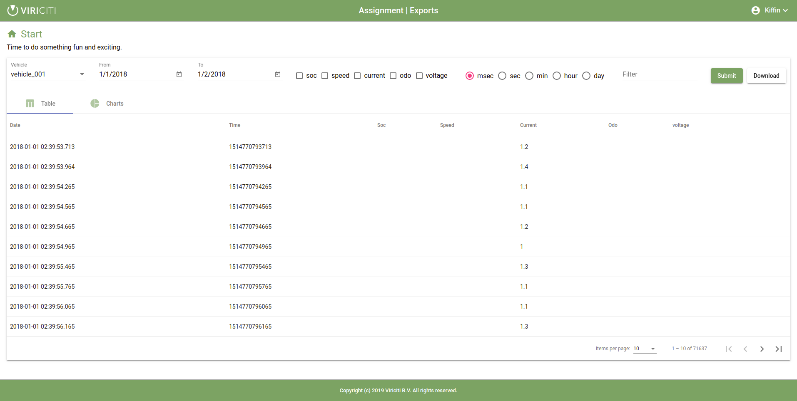

# Frontend

## Introduction

The frontend is a responsive web application built using Angular and Material Design.



## General information

The user instructions for the application are very simple.

* Login (first register if you haven't done so already)
* Select a vehicle name
* Select a date range
* Hit the submit button
* Results will be listed in the data table.
* Filter, select and sort the results.
* Download the CSV file.

The vehicle attributes (soc, speed, current, odo and voltage) are listed as checkboxes in the column headers and can be checked in order to filter the results by only those records containing non-empty values of that attribute.

Also, a list of radio buttons allow you to generate results per time interval (msec, sec, min, hour, day). This will redisplay the data by average value over the given time interval. The default view is msec.

There are two tabs displayed: table and chart. The default is table. By selected the chart tab you can view charts of the different attributes based
on the displayed dataset.

Uses the [chartJS](https://www.chartjs.org) library.


## Authorization

The application needs to login first to the backend using JWT authentication. Upon successful authentication, the token is stored and passed with
each API request in the authentication header.

This is taken care of by the token HTTP interceptor.

interceptors/token.interceptor.ts
```
@Injectable()
  intercept(request: HttpRequest<any>, next: HttpHandler): Observable<HttpEvent<any>> {

    if (this.token) {
      request = request.clone({ setHeaders: { Authorization: `Bearer ${this.token}` } });
    }

    return next.handle(request);
  }
```

## Pages

This is a very lightweight application and only consists of the following (routed) pages.

* Signup
* Signin
* Home

If the application detects that you are not logged in, you will be directed to the signin page.

This is accomplished by the authentication guard.

guards/auth.guard.ts
```
@Injectable({
  providedIn: 'root'
})
export class AuthGuard implements CanActivate {

  loggedIn: boolean;

  constructor(private auth: AuthService, private router: Router) {
    auth.token.subscribe(token => this.loggedIn = !!token);
  }

  canActivate(next: ActivatedRouteSnapshot, state: RouterStateSnapshot): boolean {
    if (this.loggedIn) {
      return true;
    }
    this.router.navigate([ '/signin' ]);
    return false;
  }
}
```

## Charts

The charts are generated using the [ChartJS](https://www.chartjs.org/) library. Based on the data which is visible in the table, the relevant line chart is created.


## Proxy

Any HTTP calls starting with /api will be proxied to the backend target.

proxy.conf.json
```
{
 "/api/*": {
    "target": "http://localhost:3000",
    "secure": false,
    "changeOrigin": true,
    "pathRewrite": {
      "^/api": ""
    }
  }
}
```

## Theme

I did my best to implement a pseudo Viriciti (green) house-style but admit that it is not perfect. Fortunately, once you know the defined color palettes, Material Design makes it very easy to implement.

Have a look in the styles directory.

```
styles
├── main.scss
├── theme.scss
└── viriciti.scss
```

## Utils

The `lib/utils` directory contains a number of useful utilities.

* date-format: a collection of tools for formatting the date column in the data table.
* export-to-csv: exports JSON to a CSV file for downloading.
* get-form-error: generic error messages for form validation.
* aggregate-times: filter for displaying time intervals data table.


## Export

The user can download a CSV document by clicking on the download button.

The file name is formatted as `${vehicle_name}-${from_date}-${to_date}.csv`

Uses the [export-to-csv](https://www.npmjs.com/package/export-to-csv) library.

```
onDownload() {
  ...
  document.body.appendChild(textarea);
  ...
  textarea.value = exportToCsv(data, vehicle.name, fromDate, toDate);
  textarea.select();
  document.execCommand('copy');
  document.body.removeChild(textarea);
}
```

For more details, see [lib/utils/export-to-csv.ts](./src/lib/utils/export-to-csv.ts).


## Quality Assurance

### Linting

Validate correctness of source code.

```
$ npm run lint
```

### Testing

Run the unit tests.

```
$ npm run test
```

Run the end-to-end tests.

```
$ npm run e2e
```

## References

* [Angular](https://angular.io)
* [JWT](https://jwt.io)
* [Material CDK](https://material.angular.io)
* [TypeScript](https://www.typescriptlang.org)
* [ChartJS](https://www.chartjs.org)
* [export-to-csv](https://www.npmjs.com/package/export-to-csv)
